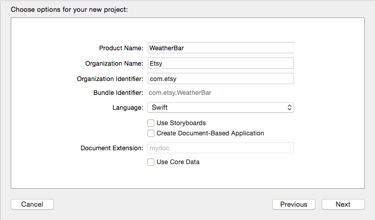
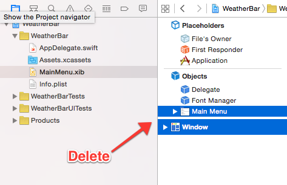
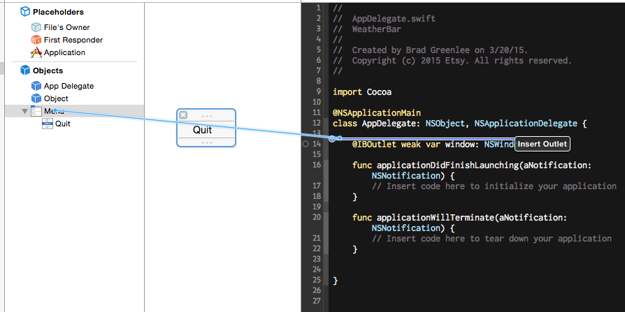

This tutorial will walk you through writing a Mac Menu Bar (aka Status Bar) app, using [Swift](https://developer.apple.com/swift/). We'll build a simple weather app using data from [OpenWeatherMap](http://openweathermap.org/). In the end, it will look like this:

The complete code can be found at <https://github.com/bgreenlee/WeatherBar>, with step of the tutorial in its own branch.

## What's a Menu Bar App and Why Would I Want to Write One?

Technically, they're Status Bar apps, but most people outside of Apple will refer to them as Menu Bar apps.



Menu Bar apps are great for creating quick utilities. Because the UI is fairly constrained, they are easy to design and create. They're especially well-suited for processes that run in the background, or for quick reference.

## Prerequisites

You should have the latest stable version of [Xcode](https://itunes.apple.com/us/app/xcode/id497799835?mt=12). At the time of this writing, that is 6.2. As Swift is a language still under heavy development, it's not unlikely that the code written here may fail to compile on earlier or later versions. I'll try to keep this up-to-date, but if you find any errors, please [let me know](mailto:brad@footle.org).

## Let's Get Something Running ([code](https://github.com/bgreenlee/WeatherBar/tree/step-00))

Open Xcode.

Create a New Project or *File ⟶ New ⟶ Project*

Choose *Application ⟶ Cocoa Application* under OS X and click Next

Product Name: *WeatherBar*, Language *Swift*, uncheck *Use Storyboards*. Organization name and identifier are not important at this stage. Make something up if you like. (But you probably should use something other than Etsy.)

Hit next and save somewhere.

### Let's Code!

Click on *MainMenu.xib*

Under Objects, delete the default window and menu.

Go to the library, type "menu" and drag out an *NSMenu*.

Delete all but one menu item.

Rename the last menu item to *Quit*.

Open the Assistant Editor (⌥⌘↩), this lets us have the Interface Builder and our code side-by-side. Make sure *AppDelegate.swift* is in the right-hand pane.

Ctrl-drag from Menu to code and create a `statusMenu`outlet.

Ctrl-drag from the *Quit* menu item to the code and create a `quitClicked` **action** (set type to *NSMenuItem*)

In *AppDelegate.swift*, delete the `window` var, and under `statusMenu`, add:

~~~ swift
let statusItem = NSStatusBar.systemStatusBar().statusItemWithLength(-1) // NSVariableStatusItemLength
~~~

(The -1 represents the constant `NSVariableStatusItemLength` (-2 is `NSSquareStatusItemLength`), which for some reason hasn't been ported over to Swift yet.)

In `applicationDidFinishLaunching`, add:

~~~ swift
statusItem.title = "WeatherBar"
statusItem.menu = statusMenu
~~~

And in `quitClicked`:

~~~ swift
NSApplication.sharedApplication().terminate(self)
~~~

Run it! You have a working menu bar app.

## Make it Look Like a Real Menu Bar App ([code](https://github.com/bgreenlee/WeatherBar/tree/step-01-icon))

You might have noticed an icon shows up in your Dock when you ran your app. You also get the default application menus on the left side of the status bar. Menu bar apps don't need either of those, so let's get rid of them.

Click the application name in the navigator on the left side, then Info in the center pane.

Under *Custom OS X Application Target Properties*, add new property (click on the any property and then on the + that appears).

Type "Application is agent (UIElement)" and set the value to YES.

Run it again and you'll see the Dock icon and default menus are gone.

### Create an Icon

For the icon that goes in the status bar, you need two versions, one 18x18 , and one 2x version at 36x36 .

Click **Images.xcassets**, then the plus button on the bottom of the next panel to the right, and select **New Image Set**. Name the image set "statusIcon" and drag the icons into the 1x and 2x boxes.

In `applicationDidFinishLaunching`, add:

~~~ swift
let icon = NSImage(named: "statusIcon")
icon?.setTemplate(true) // best for dark mode
statusItem.image = icon
statusItem.menu = statusMenu
~~~

Delete the `statusItem.title` line.

Try running it again.

## Reorganize ([code](https://github.com/bgreenlee/WeatherBar/tree/step-02-reorg))

Before we add more code, we should find a better place to put it. The AppDelegate is really meant to be used only for handling application lifecycle events. We *could* dump all our code in there, but at some point you're going to hate yourself.

Create a controller for the status menu: File ⟶ New File ⟶ Source ⟶ Cocoa Class ⟶ "StatusMenuController", with a subclass of NSObject. And let's move over our code from the AppDelegate. It should contain:

~~~ swift
import Cocoa

class StatusMenuController: NSObject {
    @IBOutlet weak var statusMenu: NSMenu!

    let statusItem = NSStatusBar.systemStatusBar().statusItemWithLength(-1) // NSVariableStatusItemLength

    override func awakeFromNib() {
        let icon = NSImage(named: "statusIcon")
        icon?.setTemplate(true) // best for dark mode
        statusItem.image = icon
        statusItem.menu = statusMenu
    }

    @IBAction func quitClicked(sender: NSMenuItem) {
        NSApplication.sharedApplication().terminate(self)
    }
}
~~~

Remove the above code from AppDelegate.

We'll need to reconnect everything again. We'll also need to make sure that our StatusMenuController gets loaded when MainMenu.xib gets loaded. To do that, we need to add it as an Object in the XIB.

Go to **MainMenu.xib**. In the Library, type "object", and then drag an Object over to just above your Menu.

Name the Object "StatusMenuController", select the Identity Inspector (⌥⌘3), and enter "StatusMenuController" in the Class field.

Right-click on the StatusMenuController object, and under Outlets, drag the circle next to **statusMenu** over to your Menu object.

Do that again for the **quitClicked** action, going to your Quit menu item.

Finally, right-click on the App Delegate object and click the X next to the statusMenu outlet to clear that association.

Now, when the application is launched and the **StatusMenu.xib** is instantiated, our StatusMenuController will receive `awakeFromNib`, and we can do what we need to initialize the status menu.

## Step 3: Calling the API ([code](https://github.com/bgreenlee/WeatherBar/tree/step-03-api))

The next thing we need is something to manage communication with the weather API.

File ⟶ New File ⟶ Source ⟶ Swift File ⟶ WeatherAPI.swift

~~~ swift
class WeatherAPI {
    let BASE_URL = "http://api.openweathermap.org/data/2.5/weather?units=imperial&q="

    func fetchWeather(query: String) {
        let session = NSURLSession.sharedSession()
        let escapedQuery = query.stringByAddingPercentEncodingWithAllowedCharacters(NSCharacterSet.URLQueryAllowedCharacterSet())
        let url = NSURL(string: BASE_URL + escapedQuery!)
        let task = session.dataTaskWithURL(url!) { data, response, error in
            let dataString = NSString(data: data, encoding: NSUTF8StringEncoding) as String
            NSLog(dataString)
        }
        task.resume()
    }
}
~~~

Now we need a way to call this. We could just stick a call in **AppDelegate** or **StatusMenuController#awakeFromNib**, but let's be a little less lazy and add a menu item to call it.

In MainMenu.xib, type "Menu Item" into the library search field (bottom right), and drag a Menu Item over to above Quit in your menu. While we're at it, drag a Separator Menu Item between those two.

Rename the new menu item "Update". Open the Assistant Editor with **StatusMenuController.swift** and ctrl-drag from Update over to your code above `quitClicked` and create a new action, `updateClicked`, with the type again as **NSMenuItem**.

We need to instantiate **WeatherAPI**, so in **StatusMenuController** at the top, under `let statusItem` add:

~~~ swift
let weatherAPI = WeatherAPI()
~~~

and in `updateClicked`, add:

~~~ swift
weatherAPI.fetchWeather("Seattle")
~~~

Run it, and select Update. You should see the JSON response in the console.

Now, you probably want it to fetch the weather as soon as the app launches. Let's reorganize `StatusMenuController` a bit, adding an `updateWeather` method. Here's what it looks like now:

~~~ swift
class StatusMenuController: NSObject {
    @IBOutlet weak var statusMenu: NSMenu!

    let statusItem = NSStatusBar.systemStatusBar().statusItemWithLength(-1) // NSVariableStatusItemLength
    let weatherAPI = WeatherAPI()

    override func awakeFromNib() {
        let icon = NSImage(named: "statusIcon")
        icon?.setTemplate(true) // best for dark mode
        statusItem.image = icon
        statusItem.menu = statusMenu

        updateWeather()
    }

    func updateWeather() {
        weatherAPI.fetchWeather("Seattle")
    }

    @IBAction func updateClicked(sender: NSMenuItem) {
        updateWeather()
    }

    @IBAction func quitClicked(sender: NSMenuItem) {
        NSApplication.sharedApplication().terminate(self)
    }
}
~~~

## Parsing JSON ([code](https://github.com/bgreenlee/WeatherBar/tree/step-04-json-parsing))

Parsing JSON is a little awkward in Swift, and people have written libraries–like [SwiftyJSON](https://github.com/SwiftyJSON/SwiftyJSON)–to make this easier, but our needs are simple and I don't want to complicate things with installing external libraries (although if you do, the two main package managers for Xcode are [Carthage](https://github.com/Carthage/Carthage) and [CocoaPODS](http://cocoapods.org/)).

Here's the JSON returned by OpenWeatherMap:

~~~ json
{
    "coord": {
        "lon": -122.33,
        "lat": 47.6
    },
    "sys": {
        "type": 1,
        "id": 2923,
        "message": 0.0242,
        "country": "United States of America",
        "sunrise": 1426774374,
        "sunset": 1426818056
    },
    "weather": [{
        "id": 800,
        "main": "Clear",
        "description": "sky is clear",
        "icon": "01d"
    }],
    "base": "cmc stations",
    "main": {
        "temp": 52.41,
        "pressure": 1020,
        "humidity": 76,
        "temp_min": 48.2,
        "temp_max": 57
    },
    "wind": {
        "speed": 7.78,
        "deg": 180
    },
    "clouds": {
        "all": 1
    },
    "dt": 1426790612,
    "id": 5809844,
    "name": "Seattle",
    "cod": 200
}
~~~

There's a lot of information we could use here, but for now let's keep it simple and just take the city name, current temperature, and the weather description. Let's first create a place to put the weather data. In **WeatherAPI.swift**, add a struct at the top of the file:

~~~ swift
struct Weather {
    var city: String
    var currentTemp: Float
    var conditions: String
}
~~~

Now add a function to parse the incoming JSON data and return a Weather object:

~~~ swift
func weatherFromJSONData(data: NSData) -> Weather? {
    var err: NSError?
    typealias JSONDict = [String:AnyObject]

    if let json = NSJSONSerialization.JSONObjectWithData(data, options: NSJSONReadingOptions.allZeros, error: &err) as? JSONDict {
        var mainDict = json["main"] as JSONDict
        var weatherList = json["weather"] as [JSONDict]
        var weatherDict = weatherList[0]

        var weather = Weather(
            city: json["name"] as String,
            currentTemp: mainDict["temp"] as Float,
            conditions: weatherDict["main"] as String
        )

        return weather
    }
    return nil
}
~~~

We return an **Optional(Weather)** because it's possible the JSON may fail to parse.

Now, change the `fetchWeather` function to call `weatherFromJSONData`:

~~~ swift
let task = session.dataTaskWithURL(url!) { data, response, error in
    let weather = self.weatherFromJSONData(data)
    NSLog("\(weather)")
}
~~~

If you run it now, you'll see that the logging isn't terribly helpful:

~~~
2015-03-19 14:58:00.758 WeatherBar[49688:1998824] Optional(WeatherBar.Weather)
~~~

To make our Weather struct printable, we need to implement the [Printable](https://developer.apple.com/library/ios/documentation/General/Reference/SwiftStandardLibraryReference/Printable.html) or **DebugPrintable** protocols, which just entails adding a `description` or `debugDescription` var. Let's do the former:

~~~ swift
struct Weather: Printable {
    var city: String
    var currentTemp: Float
    var conditions: String

    var description: String {
        return "\(city): \(currentTemp)F and \(conditions)"
    }
}
~~~

If you run it again now you'll see:

~~~
2015-03-19 15:11:49.130 WeatherBar[50731:2009152] Optional(Seattle: 58.87F and Clouds)
~~~

## Getting the Weather into the Controller ([delegate code](https://github.com/bgreenlee/WeatherBar/tree/step-05a-delegate) or [callback code](https://github.com/bgreenlee/WeatherBar/tree/step-05b-callback))

Next, let's actually display the weather in our app, as opposed to in the debug console.

First we have the problem of how we get the weather data back into our controller. The weather API call is asynchronous, so we can't just call weatherAPI.fetchWeather() and expect a Weather object in return.

There are two common ways to handle this. The most common pattern in MacOS and iOS programming (at least up until recently), is to use a delegate:

Add the following above `class WeatherAPI`:

~~~ swift
protocol WeatherAPIDelegate {
    func weatherDidUpdate(weather: Weather)
}
~~~

Add the following class variable to WeatherAPI:

~~~ swift
var delegate: WeatherAPIDelegate?
~~~

Add an initializer fuction:

~~~ swift
init(delegate: WeatherAPIDelegate) {
    self.delegate = delegate
}
~~~

And now the data fetch task in `fetchWeather` will look like this:

~~~ swift
let task = session.dataTaskWithURL(url!) { data, response, error in
    if let weather = self.weatherFromJSONData(data) {
        self.delegate?.weatherDidUpdate(weather)
    }
}
~~~

Finally, we implement the `WeatherAPIDelegate` protocol in the controller, with a few changes noted:

~~~ swift
class StatusMenuController: NSObject, WeatherAPIDelegate {
...
  var weatherAPI: WeatherAPI!

  override func awakeFromNib() {
    ...
    weatherAPI = WeatherAPI(delegate: self)
    updateWeather()
  }
  ...
  func weatherDidUpdate(weather: Weather) {
    NSLog(weather.description)
  }
  ...
~~~

However, with the relatively recent introduction of blocks to Objective-C, and Swift's first-class functions, a simpler way is to use callbacks:

~~~ swift
func fetchWeather(query:String, success: (Weather) -> Void) {
    let session = NSURLSession.sharedSession()
    let escapedQuery = query.stringByAddingPercentEncodingWithAllowedCharacters(NSCharacterSet.URLQueryAllowedCharacterSet())
    let url = NSURL(string: BASE_URL + escapedQuery!)
    let task = session.dataTaskWithURL(url!) { data, response, error in
        if let weather = self.weatherFromJSONData(data) {
            success(weather)
        }
    }
    task.resume()
}
~~~

Here, `success` is a function that takes a Weather object as a parameter and returns `Void` (nothing).

In our controller:

~~~ swift
func updateWeather() {
    weatherAPI.fetchWeather("Seattle, WA") { weather in
        NSLog(weather.description)
    }
}
~~~

## Displaying the Weather ([code](https://github.com/bgreenlee/WeatherBar/tree/step-06-displaying))

Finally, we'll update our menu to display the weather.

In MainMenu.xib, add a new MenuItem between Update and Quit (and another separator) and rename it "Weather".

In your controller, in `updateWeather`, replace the `NSLog` with:

~~~ swift
if let weatherMenuItem = self.statusMenu.itemWithTitle("Weather") {
    weatherMenuItem.title = weather.description
}
~~~

Run and voila!

The weather is greyed out because we have no action associated with selecting it. We could have it open a web page to a detailed forecast, but instead next we'll make a nicer display.

## Creating a Weather View ([code](https://github.com/bgreenlee/WeatherBar/tree/step-07-weather-view))

Open MainMenu.xib.

Drag a Custom View onto the page.

Drag a Image View into the upper left corner of the view, and in the Image View's Size Inspector, set the width and height to 50.

Add Labels for city and current temperature/conditions (we'll use one label for both temperature and conditions).

Adjust the view size down to about 265 x 90 (you can set that in the Image View's Size Inspector). It should look roughly like this:

New File ⟶ Source ⟶ Cocoa Class, name it WeatherView and make it a subclass of NSView, and save. The file will contain a stub `drawRect` method which you can delete.

Back in MainMenu.xib, click on the View, and in the Identity Inspector, set the class to "WeatherView". Now use the Assistant editor to bring up the xib and class file side-by-side, and then ctrl-drag from the xib to create outlets for each of the elements in the view. WeatherView.swift should look like:

~~~ swift
import Cocoa

class WeatherView: NSView {
    @IBOutlet weak var imageView: NSImageView!
    @IBOutlet weak var cityTextField: NSTextField!
    @IBOutlet weak var currentConditionsTextField: NSTextField!
}
~~~

Now add a method to WeatherView so we can update it with a Weather object:

~~~ swift
    func update(weather: Weather) {
        cityTextField.stringValue = weather.city
        currentConditionsTextField.stringValue = "\(Int(weather.currentTemp))°F and \(weather.conditions)"
    }
~~~

Now bring up StatusMenuController in the Assistant editor, and ctrl-drag from the Weather View object over to the top of the StatusMenuController class to create a `weatherView` outlet. While we're there, we're going to add a `weatherMenuItem` class var:

~~~ swift
class StatusMenuController: NSObject {
    @IBOutlet weak var statusMenu: NSMenu!
    @IBOutlet weak var weatherView: WeatherView!
    var weatherMenuItem: NSMenuItem!
    ...
~~~

In StatusMenuController's `awakeFromNib` method, right before the call to `updateWeather`, add:

~~~ swift
weatherMenuItem = statusMenu.itemWithTitle("Weather")
weatherMenuItem.view = weatherView
~~~

And now `updateWeather` is even simpler:

~~~ swift
func updateWeather() {
    weatherAPI.fetchWeather("Seattle, WA") { weather in
        self.weatherView.update(weather)
    }
}
~~~

Run it!

## Adding the Weather Image ([code](https://github.com/bgreenlee/WeatherBar/tree/step-08-weather-image))

So, we're obviously missing something in our weather view. Let's update it with the appropriate weather image.

The images for the various weather conditions can be found at http://openweathermap.org/weather-conditions, but I've put them in a [zip file](assets/weather-icons.zip) for you. You can just unzip that and drag the whole folder into **Images.xcassets**.

We need to update **WeatherAPI** to capture the icon code. In the Weather struct, add:

~~~ swift
var icon: String
~~~

and in `weatherFromJSONData`, add that to the Weather initialization:

~~~ swift
var weather = Weather(
    city: json["name"] as String,
    currentTemp: mainDict["temp"] as Float,
    conditions: weatherDict["main"] as String,
    icon: weatherDict["icon"] as String
)
~~~

Now in the `update` method of WeatherView, add:

~~~ swift
imageView.image = NSImage(named: weather.icon)
~~~

That's it! Run it.

## Preferences ([code](https://github.com/bgreenlee/WeatherBar/tree/step-09-preferences))

Having the city hard-coded in the app is not cool. Let's make a Preferences pane so we can change it.

Open up **MainMenu.xib** and drag another MenuItem onto the menu, above Quit, naming it "Preferences...".

Open up the Assistant editor again with StatusMenuController, and ctrl-drag from the Preferences menu item over to the code and create a "preferencesClicked" action.

New ⟶ File ⟶ Source ⟶ Cocoa Class. Call it "PreferencesWindow", set the subclass to NSWindowController, and check the box to create a XIB file.

Give the window a title of Preferences. Add a label for "City:", and put a Text Field to the right of it. It should look something like this:

Fancy!

Bring up the Assistant editor with **PreferencesWindow.swift** and ctrl-drag from the text field to the code and create an outlet named "cityTextField".

In PreferencesWindow.swift, add:

~~~ swift
override var windowNibName : String! {
    return "PreferencesWindow"
}
~~~

and at the end of `windowDidLoad()`, add:

~~~ swift
self.window?.center()
self.window?.makeKeyAndOrderFront(nil)
NSApp.activateIgnoringOtherApps(true)
~~~

In **StatusMenuController.swift**, add a `preferencesWindow` class var:

~~~ swift
var preferencesWindow: PreferencesWindow!
~~~

and initialize in `awakeFromNib()`, before the call to `updateWeather()`:

~~~ swift
preferencesWindow = PreferencesWindow()
~~~

Finally, in the `preferencesClicked` function, add:

~~~ swift
preferencesWindow.showWindow(nil)
~~~

If you run now, selecting the Preferences... menu item should bring up the preferences window.

Now, let's actually save and update the city.

Make the PreferencesWindow class an `NSWindowDelegate`:

~~~ swift
class PreferencesWindow: NSWindowController, NSWindowDelegate {
~~~

and add:

~~~ swift
func windowWillClose(notification: NSNotification) {
    NSLog("city is: " + cityTextField.stringValue)
}
~~~

If you run it now, you'll see whatever you typed in the text field displayed when you close the window.

Saving the value is easy:

~~~ swift
func windowWillClose(notification: NSNotification) {
    let defaults = NSUserDefaults.standardUserDefaults()
    defaults.setValue(cityTextField.stringValue, forKey: "city")
}
~~~

Now we need to notify the StatusMenuController that the preferences have been updated. For this we'll use the Delegate pattern. This is easy, but requires a number of edits. First, at the top of PreferencesWindow.swift, add a `PreferencesWindowDelegate` protocol:

~~~ swift
protocol PreferencesWindowDelegate {
    func preferencesDidUpdate()
}
~~~

and add a `delegate` instance variable:

~~~ swift
var delegate: PreferencesWindowDelegate?
~~~

At the end of `windowWillClose`, we'll call the delegate:

~~~ swift
delegate?.preferencesDidUpdate()
~~~

Back in StatusMenuController, make it a `PreferencesWindowDelegate`:

~~~ swift
class StatusMenuController: NSObject, PreferencesWindowDelegate {
~~~

and add the delegate method:

~~~ swift
func preferencesDidUpdate() {
    updateWeather()
}
~~~

And in `awakeFromNib`, set the delegate:

~~~ swift
preferencesWindow = PreferencesWindow()
preferencesWindow.delegate = self
~~~

All that's left is to load the city from defaults. First add this at the top of StatusMenuController, under the imports:

~~~ swift
let DEFAULT_CITY = "Seattle, WA"
~~~

(...or whatever you want the default to be.) Yes, this is a global variable, and there are probably better ways to do this (like storing it in Info.plist), but that can be left as an exercise for the reader.

Load the saved city, or default, in `updateWeather`:

~~~ swift
func updateWeather() {
    let defaults = NSUserDefaults.standardUserDefaults()
    let city = defaults.stringForKey("city") ?? DEFAULT_CITY
    weatherAPI.fetchWeather(city) { weather in
        self.weatherView.update(weather)
    }
}
~~~

Finally, back in PreferencesWindow.swift, we need to add similar code to load any saved city when we show the preferences. At the end of `windowDidLoad`, add:

~~~ swift
let defaults = NSUserDefaults.standardUserDefaults()
let city = defaults.stringForKey("city") ?? DEFAULT_CITY
cityTextField.stringValue = city
~~~

Run it!

## Next Steps

That's the end of this tutorial. Obviously there's a lot more that we can do with this, but I'll leave that up to you. Some ideas:

### Easy

- Add other weather info (high/low temp, humidity, sunrise/sunset, etc) to the Weather View
- Change the status menu icon + title to reflect the current conditions
- Add a timer to update the weather regularly (hint: `NSRunLoop.mainRunLoop().addTimer(refreshTimer!, forMode: NSRunLoopCommonModes)`).
- Make it so clicking on the Weather View opens a browser with detailed weather information (hint: `NSWorkspace.sharedWorkspace().openURL(url: NSURL)`). Note that since we're using a custom view, the menu item isn't highlighted when you mouse over it, so you'll probably want to do something to make it obvious that it is clickable.
- Add some error handling. Right now if we get an unexpected response from the API, for example, bad things will happen.
- [Write some tests!](https://developer.apple.com/library/mac/documentation/DeveloperTools/Conceptual/testing_with_xcode/Introduction/Introduction.html#//apple_ref/doc/uid/TP40014132-CH1-SW1)
- Add an app icon. This isn't hard, but it can be a pain creating the [various sizes that Apple wants](https://developer.apple.com/library/mac/documentation/GraphicsAnimation/Conceptual/HighResolutionOSX/Optimizing/Optimizing.html). Fortunately, there are [tools to make this easier](https://itunes.apple.com/us/app/asset-catalog-creator-app/id809625456?mt=12).
- Add a preference to launch the app on login. I've used the [LaunchAtLoginController](https://github.com/Mozketo/LaunchAtLoginController) library in other apps. There's also [this blog post](http://bdunagan.com/2010/09/25/cocoa-tip-enabling-launch-on-startup/), if you want to try porting the code over to Swift.
- Create an About window.

### More Challenging

- Add support for multiple cities. This will take some effort, especially if the number of cities is dynamic. I think you'll have to put the Weather View in its own XIB, and load it manually (look at `NSBundle.mainBundle().loadNibNamed(name, owner: owner, options: options)`). The UI in Preferences will obviously need to be updated as well.

### You Know Way More Than Me Now

- Create a completely custom view when clicking on the app in the status bar. See the [Weather Live](https://itunes.apple.com/us/app/weather-live/id755717884?mt=12) app, for example. I haven't tried this, but I suspect it is easier than you might think (depending on how fancy your view is, of course).

## Resources

**[The Swift Programming Language](https://developesur.apple.com/library/ios/documentation/Swift/Conceptual/Swift_Programming_Language/)** - Apple's documentation, also downloadable as a [free iBook](https://itunes.apple.com/us/book/the-swift-programming-language/id881256329?mt=11)

**[Apple's Swift Blog](https://developer.apple.com/swift/blog/)** and **[Swift Resources](https://developer.apple.com/swift/resources/)** - Straight from the source.

**[NSHipster](http://nshipster.com/)** - Tons of great, in-depth articles on Objective-C, Swift, and Cocoa

**[Ray Wenderlich's Tutorials](http://www.raywenderlich.com/tutorials)** - Puts this tutorial to shame.

**[Mike Ash's NSBlog](https://mikeash.com/pyblog/)** - Great deep dives into Objective-C and Swift

## Contact

Got questions, feedback, or corrections? [Hit me up!](mailto:brad@footle.org) (You can also submit and [issue](https://github.com/bgreenlee/WeatherBar/issues) or [pull request](https://github.com/bgreenlee/WeatherBar/pulls).)
